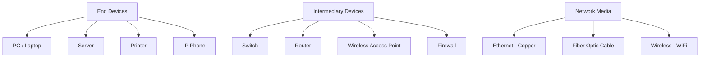
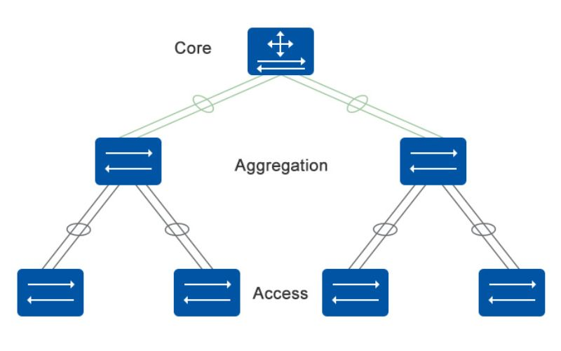
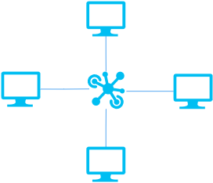
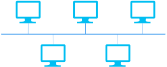
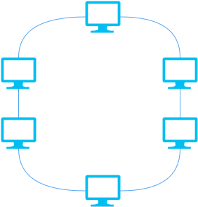
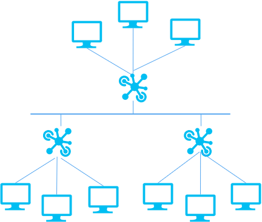
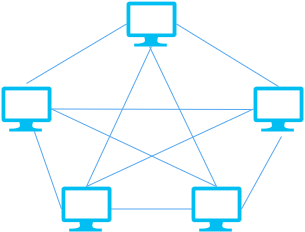
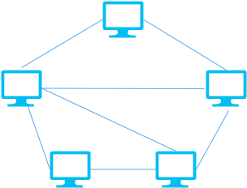
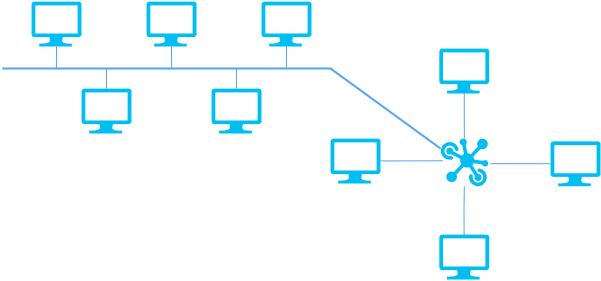

# 📡 Data Communication Network Basics

---

## Communication & Networks

### Communication
**Communication** is the transfer of information between people or devices.

### Network Communication
**Network communication** is the exchange of data between end devices through a computer network.

### Computer Network

A **computer network** consists of three main components:

#### Intermediary Devices
Devices that connect end devices and control data flow.

##### 1️⃣ Switch
- Operates at the **Data Link Layer (Layer 2)**
- Forwards **data frames** based on MAC addresses
- Closest device to end users

  

> [!NOTE]
> A switch has **one broadcast domain**
> Broadcast frames sent from one port are forwarded to **all other ports**

##### 2️⃣ Router
- Operates at the **Network Layer (Layer 3)**
- Forwards **packets** based on destination IP address

**Functions:**
- Builds routing tables
- Path selection and packet forwarding
- **Broadcast domain isolation**
- Network Address Translation (NAT)

**Important Concept:**
- Broadcast traffic does **not** pass between router interfaces

##### 3️⃣ Firewall
- A **network security device**
- Located between networks with different trust levels
- Filters traffic based on security rules

##### 4️⃣ Wireless Devices (AP & AC)

**Access Point (AP)**
- Uses wireless signals (IEEE **802.11** standards)
- Connects wireless devices to a wired network

**AP Modes:**
- **Fat AP:** Standalone (home networks)
- **Fit AP:** Requires Access Controller (enterprise networks)
- **Cloud-managed AP:** Centralized cloud control (SMEs)

**Access Controller (AC)**
- Centralized wireless control
- Usually deployed at the **aggregation layer**
- Manages multiple APs

---

##  Network Types & Topologies

### Network Types

#### LAN - Local Area Network
**Characteristics:**
- Covers a small geographic area
- Connects devices within a building or campus

**Technologies:**
- Ethernet
- Wi-Fi

#### MAN - Metropolitan Area Network
**Characteristics:**
- Larger than LAN
- Connects LANs within a city

**Technologies:**
- High-speed Ethernet (10 Gbps / 100 Gbps)
- WiMAX

#### WAN - Wide Area Network
**Characteristics:**
- Covers large geographic areas
- Connects LANs and MANs over long distances

**Technologies:**
- HDLC
- PPP

---

### Network Topologies

| Topology | Shape | Definition | Advantages | Disadvantages |
|--------|--------|------------|------------|---------------|
| Point-to-Point | 

 | Direct link between two devices | Simple, fast | No redundancy |
| Star | 

 | All devices connect to a central device | Easy to manage | Central device failure |
| Bus | 

 | All devices share one cable | Low cost | Collisions, hard troubleshooting |
| Ring | 

 | Devices form a closed loop | Predictable performance | Single failure affects network |
| Tree | 

 | Hierarchical structure | Scalable | Complex management |
| Mesh | 

 | Devices interconnected | High reliability | High cost |
| Partial Mesh | 

 | Some devices fully connected | Balanced cost & reliability | Complex design |
| Hybrid | 

 | Combination of topologies | Flexible | Design complexity |

---

## Network Engineering & Engineer

### Network Engineering
A collection of activities related to networking, including:
- Network planning
- Network design
- Implementation
- Commissioning
- Troubleshooting

---

### Network Engineer
A professional responsible for designing, implementing, managing, and securing computer networks.

