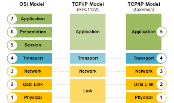
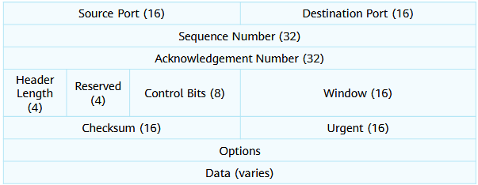
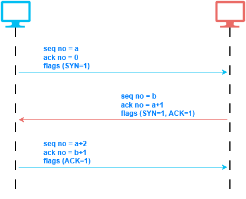
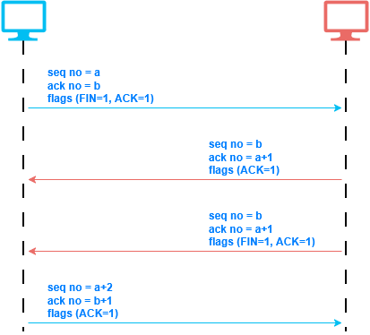

# Network Reference Model

## Applications and Data

### Applications

Applications are software programs that generate, request, and process data for users or other applications over a network.  

**Examples of network applications:**  

- Web browsers (HTTP / HTTPS)
- Email applications (SMTP, POP3, IMAP)
- File transfer applications (FTP, SFTP)
- Voice and video applications (VoIP, video conferencing)

---

### Information

Information is processed and meaningful data that is exchanged between applications.  

## Network Reference Model and Standard Protocols

  

### 7️⃣ **Application Layer**

* Provides **network services** directly to end-user applications
* Enables applications to **access network resources**

| Protocol   | Port(s) | Transport | Description  |
| --- | --- | --- | --- |
| **HTTP**   | 80      | TCP       | Hypertext Transfer Protocol – provides web browsing services                 |
| **Telnet** | 23      | TCP       | Remote login protocol – provides remote device management                    |
| **SSH**    | 22      | TCP       | Secure Shell – provides secure remote login and management                   |
| **FTP**    | 20, 21  | TCP       | File Transfer Protocol – provides file upload and download services          |
| **SMTP**   | 25      | TCP       | Simple Mail Transfer Protocol – provides email sending services              |
| **TFTP**   | 69      | UDP       | Trivial File Transfer Protocol – provides simple file transfer services      |
| **DNS**    | 53      | UDP / TCP | Domain Name System – translates domain names into IP addresses               |
| **DHCP**   | 67, 68  | UDP       | Dynamic Host Configuration Protocol – automatically assigns IP configuration |

---

### 6️⃣ **Presentation Layer**

* **Data encoding and decoding**
* **Format conversion** (e.g., character sets)
* **Encryption and compression**

> Ensures data is in a readable format for the application layer.

---

### 5️⃣ **Session Layer**

* **Establishes, manages, and terminates sessions** between applications
* Controls **dialog and synchronization**

> Manages communication sessions, not the data itself.

---

### 4️⃣ **Transport Layer – Segments / Datagrams**

* Provides **end-to-end communication**
* Supports:

  * **Connection-oriented communication (TCP)**
  * **Connectionless communication (UDP)**
* **Error detection and recovery**
* Flow control and segmentation

**TCP header - 20 to 40byte**  

  

>[!Note]
> Control Bits are URG | ACK | PSH | RST | SYN | FIN  
> These are used to establish and terminate connection

**Connection Establishment - 3-way handshake:**  

  

**Connection Teardown - 4-way handshake:**  

  

**UDP header - 8byte**  

  

---

### 3️⃣ **Network Layer – Packets**

* Provides **logical addressing (IP addresses)**
* Determines the **best path** from source to destination
* Handles **packet forwarding and routing**
* Common protocols: IPv4, IPv6, ICMP (Internet Control Message Protocol), IGMP (Internet Group Managment Protocol)

---

### 2️⃣ **Data Link Layer – Frames**

* Provides **physical (MAC) addressing**
* Controls **media access**
* Performs **error detection**
* Responsible for node-to-node delivery.
* Common protocols: Ethernet and PPP.

#### MAC Address  
a six groups of two hexadecimal digits, separated by
hyphens, colons, or without a separator

**Common names for MAC:**  
* Physical Address
* L2 address
* Hardware address
* Burned In Address - BIA
* NIC address

#### ARP - Address Resolution Protocol
It is used to discover the MAC address for a given IP address

**Steps:**  
1. Before sending the datagram the device searches the ARP table for MAC address corresponding to the given IP
2. If found, we know the destination MAC address. If not, the device send ARP request to discover the MAC address (broadcast message).
3. If the destination in another network, the device search for default gateway MAC.

---

### 1️⃣ **Physical Layer – Bits**

* Transmits **raw bits (0s and 1s)** over the physical medium
* Defines:

  * Cables and connectors
  * Signaling and voltages
  * Data rates

#### Network Media

##### Cables

| Cable Type              | Sub-Type | Description                                         | Common Use                |
| ----------------------- | -------- | --------------------------------------------------- | ------------------------- |
| **Coaxial Cable**       | —        | Copper cable with strong EMI resistance             | Cable TV, legacy networks |
| **Twisted Pair Cable**  | **UTP**  | Unshielded, low cost, most common LAN cable         | Ethernet LANs             |
|                         | **STP**  | Shielded against electromagnetic interference (EMI) | Noisy environments        |
| **Optical Fiber Cable** | **SMF**  | Single-mode, long distance, yellow jacket           | WAN, long-distance links  |
|                         | **MMF**  | Multi-mode, short distance, aqua/light blue jacket  | LANs, data centers        |
| **Serial Cable**        | —        | Used for serial communication                       | WAN connections (legacy)  |

##### Connectors

| Connector Type  | Connector | Used With                    | Description                   |
| --------------- | --------- | ---------------------------- | ----------------------------- |
| **Copper**      | **RJ-45** | Twisted pair Ethernet cables | Standard Ethernet connector   |
|                 | **DB-60** | Serial cables                | Router WAN serial connections |
| **Fiber Optic** | **LC**    | Fiber cables                 | Small form-factor connector   |
|                 | **SC**    | Fiber cables                 | Square, push-pull connector   |
|                 | **FC**    | Fiber cables                 | Threaded, secure connection   |
|                 | **ST**    | Fiber cables                 | Bayonet-style connector       |

