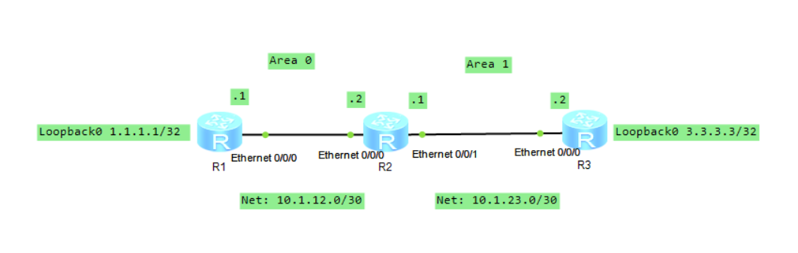

# OSPF configuration

## Requirement description

There are three routers, R1, R2, and R3. R1 and R3 are connected to networks 1.1.1.1/32 and 3.3.3.3/32 (simulated by Loopback 0), respectively. OSPF needs to be used to implement interworking between the two networks. Detailed topology was as follows:

<p align="center">
  
</p>

## Lab Solution

### Topology

<p align="center">
  
</p>


### R1 configuration
```
# interface configuration

<Huawei>system-view
[Huawei]sysname R1
[R1]interface Eth0/0/0
[R1-Ethernet0/0/0]ip address 10.1.12.1 30
[R1]interface LoopBack 0
[R1-LoopBack0]ip address 1.1.1.1 32

# OSPF configuration

[R1]ospf 1 router-id 1.1.1.1
[R1-ospf-1]area 0
[R1-ospf-1-area-0.0.0.0]network 1.1.1.1 0.0.0.0
[R1-ospf-1-area-0.0.0.0]network 10.1.12.1 0.0.0.0


# testing

[R1]display ip interface brief
*down: administratively down
!down: FIB overload down
^down: standby
(l): loopback
(s): spoofing
(d): Dampening Suppressed
The number of interface that is UP in Physical is 3
The number of interface that is DOWN in Physical is 9
The number of interface that is UP in Protocol is 3
The number of interface that is DOWN in Protocol is 9

Interface                         IP Address/Mask      Physical   Protocol  
Ethernet0/0/0                     10.1.12.1/30         up         up        
Ethernet0/0/1                     unassigned           down       down      
GigabitEthernet0/0/0              unassigned           down       down      
GigabitEthernet0/0/1              unassigned           down       down      
GigabitEthernet0/0/2              unassigned           down       down      
GigabitEthernet0/0/3              unassigned           down       down      
LoopBack0                         1.1.1.1/32           up         up(s)     
NULL0                             unassigned           up         up(s)     
Serial0/0/0                       unassigned           down       down      
Serial0/0/1                       unassigned           down       down      
Serial0/0/2                       unassigned           down       down      
Serial0/0/3                       unassigned           down       down      


<R1>display ospf peer brief

	 OSPF Process 1 with Router ID 1.1.1.1
		  Peer Statistic Information
 ----------------------------------------------------------------------------
 Area Id          Interface                        Neighbor id      State    
 0.0.0.0          Ethernet0/0/0                    2.2.2.2          Full        
 ----------------------------------------------------------------------------

<R1>display ospf lsdb 

	 OSPF Process 1 with Router ID 1.1.1.1
		 Link State Database 

		         Area: 0.0.0.0
 Type      LinkState ID    AdvRouter          Age  Len   Sequence   Metric
 Router    2.2.2.2         2.2.2.2            147  36    80000006       1
 Router    1.1.1.1         1.1.1.1            190  48    80000006       0
 Network   10.1.12.1       1.1.1.1            190  32    80000002       0
 Sum-Net   10.1.23.0       2.2.2.2            135  28    80000001       1
 Sum-Net   3.3.3.3         2.2.2.2             88  28    80000001       1
 
 
<R1>display ospf routing

	 OSPF Process 1 with Router ID 1.1.1.1
		  Routing Tables 

 Routing for Network 
 Destination        Cost  Type       NextHop         AdvRouter       Area
 1.1.1.1/32         0     Stub       1.1.1.1         1.1.1.1         0.0.0.0
 10.1.12.0/30       1     Transit    10.1.12.1       1.1.1.1         0.0.0.0
 3.3.3.3/32         2     Inter-area 10.1.12.2       2.2.2.2         0.0.0.0
 10.1.23.0/30       2     Inter-area 10.1.12.2       2.2.2.2         0.0.0.0

 Total Nets: 4  
 Intra Area: 2  Inter Area: 2  ASE: 0  NSSA: 0 

<R1>display ip routing-table 
Route Flags: R - relay, D - download to fib
------------------------------------------------------------------------------
Routing Tables: Public
         Destinations : 7        Routes : 7        

Destination/Mask    Proto   Pre  Cost      Flags NextHop         Interface

        1.1.1.1/32  Direct  0    0           D   127.0.0.1       LoopBack0
        3.3.3.3/32  OSPF    10   2           D   10.1.12.2       Ethernet0/0/0
      10.1.12.0/30  Direct  0    0           D   10.1.12.1       Ethernet0/0/0
      10.1.12.1/32  Direct  0    0           D   127.0.0.1       Ethernet0/0/0
      10.1.23.0/30  OSPF    10   2           D   10.1.12.2       Ethernet0/0/0
      127.0.0.0/8   Direct  0    0           D   127.0.0.1       InLoopBack0
      127.0.0.1/32  Direct  0    0           D   127.0.0.1       InLoopBack0

```


### R2 configuration

```
# interface configuration

<Huawei>system-view
Enter system view, return user view with Ctrl+Z.
[Huawei]sysname R2
[R2]Interface Eth 0/0/0 
[R2-Ethernet0/0/0]ip address 10.1.12.2 30
[R2-Ethernet0/0/0]interface Eth 0/0/1
[R2-Ethernet0/0/1]ip address 10.1.23.1 30


# OSPF configuration

[R2]ospf 1 router-id 2.2.2.2
[R2-ospf-1]area 0
[R2-ospf-1-area-0.0.0.0]network 10.1.12.2 0.0.0.3
[R2-ospf-1-area-0.0.0.0]area 1
[R2-ospf-1-area-0.0.0.1]network 10.1.23.0 0.0.0.3


# testing

<R2>display ospf peer

	 OSPF Process 1 with Router ID 2.2.2.2
		 Neighbors 

 Area 0.0.0.0 interface 10.1.12.2(Ethernet0/0/0)'s neighbors
 Router ID: 1.1.1.1          Address: 10.1.12.1       
   State: Full  Mode:Nbr is  Slave  Priority: 1
   DR: 10.1.12.1  BDR: 10.1.12.2  MTU: 0    
   Dead timer due in 40  sec 
   Retrans timer interval: 5 
   Neighbor is up for 00:14:41     
   Authentication Sequence: [ 0 ] 

		 Neighbors 

 Area 0.0.0.1 interface 10.1.23.1(Ethernet0/0/1)'s neighbors
 Router ID: 3.3.3.3          Address: 10.1.23.2       
   State: Full  Mode:Nbr is  Master  Priority: 1
   DR: 10.1.23.1  BDR: 10.1.23.2  MTU: 0    
   Dead timer due in 36  sec 
   Retrans timer interval: 5 
   Neighbor is up for 00:12:57     
   Authentication Sequence: [ 0 ]
```


### R3 configuration

```
# interface configuration

<Huawei>system-view
Enter system view, return user view with Ctrl+Z.
[Huawei]sysname R3
[R3]interface Eth0/0/0
[R3-Ethernet0/0/0]ip address 10.1.23.2 30
[R3-Ethernet0/0/0]interface loopBack 0
[R3-loopBack0]ip address 3.3.3.3 32


# OSPF configuration

[R3]ospf 1 router-id 3.3.3.3
[R3-ospf-1]area 1
[R3-ospf-1-area-0.0.0.1]network 3.3.3.3 0.0.0.0
[R3-ospf-1-area-0.0.0.1]network 10.1.23.0 0.0.0.3
```