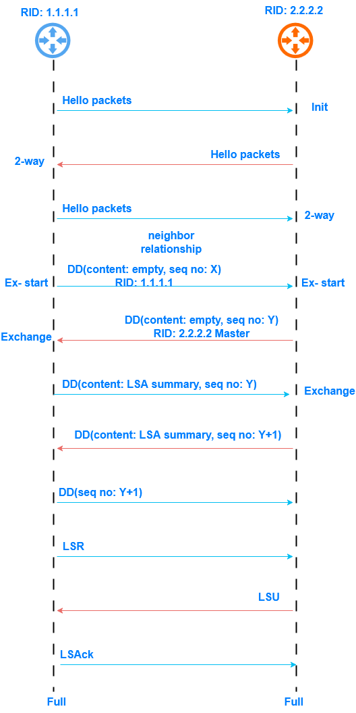

# 📘 OSPF Basics

---

## 1️⃣ OSPF Overview

### Routing Protocol Types (Quick Context)

| Type                | Description                                  | Examples                            |
| ------------------- | -------------------------------------------- | ----------------------------------- |
| **Distance Vector** | Routers know **direction and distance only** | RIPv1 (classful), RIPv2 (classless) |
| **Link State**      | Routers know **full network topology**       | OSPFv2, OSPFv3, IS-IS               |

📌 **OSPF is a Link-State routing protocol**

---

### Why Link-State?

* Routers **flood link-state information**, not routing tables
* Each router independently calculates best paths
* Faster convergence and loop-free routing

---

## 2️⃣ Link State Advertisements (LSA)

* **LSA** describes:

  * Interface status
  * Cost
  * Connected networks
  * Neighbor relationships

📌 LSAs are **flooded** throughout the OSPF area

---

## 3️⃣ Link State Database (LSDB)

**LSDB Creation Process:**

1. Each router generates its **own LSAs**
2. Routers receive LSAs from neighbors
3. All routers in the same area have an **identical LSDB**

📌 **LSDB consistency is critical**

---

## 4️⃣ SPF (Shortest Path First) Algorithm

* Uses **Dijkstra’s algorithm**
* Calculates the **shortest-path tree**
* Router itself is the **root**
* Routes are installed into the routing table after calculation

📌 Result = **loop-free routing**

---

## 5️⃣ Basic OSPF Concepts

### 📍 Area

* A **logical group of routers**
* Identified by **Area ID** (e.g. `0` or `0.0.0.0`)
* Used to **limit LSA flooding**

---

### 📍 Router ID (RID)

* **32-bit unique identifier** of a router

**Selection order:**

1. Manually configured
2. Highest loopback IP
3. Highest physical interface IP

> [!NOTE]
> In real networks, **Router IDs are always manually configured**
> RIDs must be **unique within the OSPF domain**

---

### 📍 Cost Value

```
Cost = Reference Bandwidth / Interface Bandwidth
```

| Interface        | Cost |
| ---------------- | ---- |
| Gigabit Ethernet | 1    |
| Fast Ethernet    | 10   |
| Serial           | 64   |

📌 Default reference bandwidth = **100 Mbps**

---

## 6️⃣ OSPF Packet Types

| Packet       | Purpose                       |
| ------------ | ----------------------------- |
| **Hello**    | Discover & maintain neighbors |
| **DBD (DD)** | Exchange LSDB summaries       |
| **LSR**      | Request missing LSAs          |
| **LSU**      | Send requested LSAs           |
| **LSAck**    | Acknowledge LSAs              |

---

## 7️⃣ OSPF Tables

### 1️⃣ Neighbor Table

* Shows **neighbor relationships**

```text
<R> display ospf peer
```

---

### 2️⃣ LSDB

* Stores all LSAs
* `Type` → LSA type
* `AdvRouter` → Advertising router

```text
<R> display ospf lsdb
```

---

### 3️⃣ OSPF Routing Table

* Separate from IP routing table
* Contains destination, next hop, and cost

```text
<R> display ospf routing
```

---

## 8️⃣ OSPF Working Mechanism

### Relationship Types

* **Neighbor relationship**
* **Adjacency** (full database exchange)

### Adjacency Establishment Steps

1. Establish bidirectional neighbors
2. Elect master/slave
3. Exchange LSDB summaries
4. Synchronize LSDBs
5. Run SPF independently

---

### OSPF Neighbor States (IT ELF)

```
Init → 2-Way → ExStart → Exchange → Loading → Full
```

* **2-Way** → Stable neighbor state
* **Full** → Stable adjacency

<p align="center">
  
</p>

---

## 9️⃣ OSPF Network Types

| Type          | Description         |
| ------------- | ------------------- |
| **Broadcast** | Ethernet (BMA)      |
| **NBMA**      | Frame Relay         |
| **P2P**       | Point-to-point      |
| **P2MP**      | Point-to-multipoint |

> [!NOTE]
> Interfaces on the **same link must use the same OSPF network type**

---

## 🔟 Multi-Access (MA) Networks

### Router Roles

* **DR** – Designated Router
* **BDR** – Backup DR
* **DRother** – All others

### Full Adjacency Exists Between:

* DR ↔ BDR
* DR ↔ DRother
* BDR ↔ DRother

❌ **No adjacency between DRothers**

---

### DR Election Rules

1. Higher **OSPF priority**
2. Higher **Router ID**

---

## 1️⃣1️⃣ OSPF Domain & Router Types

### OSPF Domain

* A group of contiguous routers using **same OSPF policy**

---

### Backbone Area

* **Area 0** (Backbone)
* All other areas must connect to Area 0 via **ABR**

---

### Router Types

| Router Type         | Description                             |
| ------------------- | --------------------------------------- |
| **Internal Router** | All interfaces in same area             |
| **ABR**             | Connects backbone to non-backbone areas |
| **ASBR**            | Imports external routes into OSPF       |

---

## 1️⃣2️⃣ OSPF Configuration (Huawei)

### Create OSPF Process

```text
[Huawei] ospf [process-id | router-id router-id]
```

---

### Create OSPF Area

```text
[Huawei-ospf-1] area area-id
```

---

### Enable OSPF on Interfaces

```text
[Huawei-ospf-1-area-0.0.0.0] network network-address wildcard-mask
```

---

### Set Interface Cost

```text
[Huawei-GigabitEthernet1/0/1] ospf cost cost
```

---

### Set Reference Bandwidth

```text
[Huawei-ospf-1] bandwidth-reference value
```

---

### Set DR Priority

```text
[Huawei-GigabitEthernet0/0/0] ospf dr-priority priority
```

