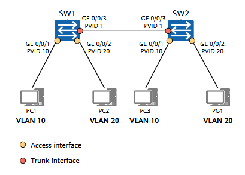
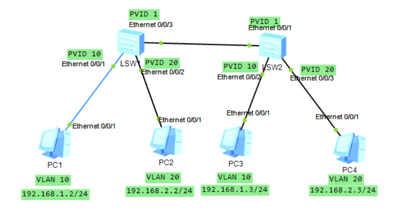

# Configuring Interface-based VLAN Assignment


## VLAN Scenario

In the network shown in the figure, enterprise switches **SW1** and **SW2** are connected to multiple PCs.
PCs providing the **same service** access the network through **different switches**.

To enhance **communication security**, the enterprise requires that **only PCs offering the same service can directly communicate** with each other.

To meet this requirement, **interface-based VLAN assignment** is configured on the switches.
Interfaces connected to PCs with the same service are assigned to the **same VLAN**.

As a result:

* PCs in **different VLANs** cannot directly communicate at **Layer 2**
* PCs in the **same VLAN** can directly communicate


<p align="center">
  
</p>


## Lab Solution

### Topology

<p align="center">
  
</p>

### SW2 Configuration
```
<Huawei>system-view
Enter system view, return user view with Ctrl+Z.
[Huawei]sysname SW2
[SW2]interface Eth 0/0/1
[SW2-Ethernet0/0/1]port link-type trunk
[SW2-Ethernet0/0/1]port trunk allow-pass vlan 10 20
[SW2-Ethernet0/0/1]quit
[SW2]vlan batch 10 20
Info: This operation may take a few seconds. Please wait for a moment...done.
[SW2]interface Eth 0/0/2
[SW2-Ethernet0/0/2]port default vlan 10
[SW2-Ethernet0/0/2]interface Eth 0/0/3
[SW2-Ethernet0/0/3]port link-type access
[SW2-Ethernet0/0/3]port default vlan 20
[SW2-Ethernet0/0/3]return
```

