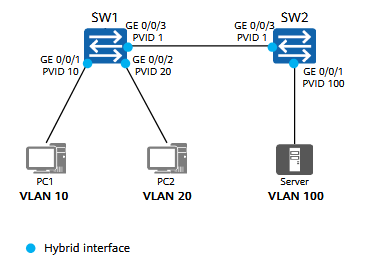
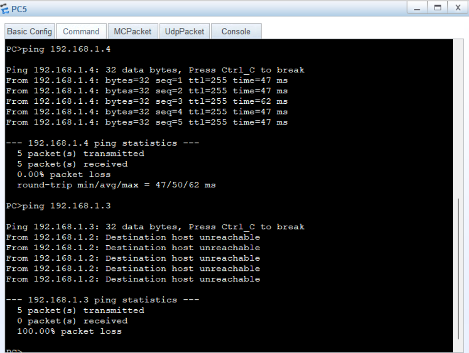

# Configuring Interface-based VLAN Assignment


## Networking Requirements

In the network shown in the figure, enterprise switches **SW1** and **SW2** are connected to multiple PCs.
PCs belonging to **different departments** need to access the **enterprise server**.

To ensure **communication security**, the enterprise requires that:

* PCs in **different departments must not directly communicate** with each other at **Layer 2**
* All PCs must still be able to **access the server**

To meet these requirements:

* Configure **interface-based VLAN assignment** on the switches
* Use **hybrid interfaces** to control VLAN tagging and forwarding

This configuration allows PCs in different VLANs to **access the server**, while preventing **direct Layer 2 communication** between departments.

<p align="center">
  
</p>

## Lab Solution

### Topology

<p align="center">
  
</p>


### Output

<p align="center">
  
</p>

### Switch 2 Configuration

```
[SW2]vlan batch 10 20 100

[SW2]interface GigabitEthernet 0/0/1
[SW2-GigabitEthernet0/0/1]port link-type hybrid
[SW2-GigabitEthernet0/0/1]port hybrid tagged vlan 10 20 100
[SW2-GigabitEthernet0/0/1]interface Eth 0/0/1
[SW2-Ethernet0/0/1]port link-type hybrid 
[SW2-Ethernet0/0/1]port hybrid untagged vlan 10 20 100
[SW2-Ethernet0/0/1]port hybrid pvid vlan 100
```
