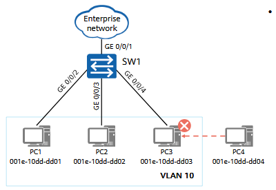

# Configuring MAC Address-based VLAN Assignment


## Networking Requirements

The network administrator assigns PCs belonging to the **same department** to the **same VLAN**.
To enhance **information security**, the enterprise requires that **only authorized employees** within a department be allowed to access the enterprise network resources.

In this scenario:

* **PCs 1, 2, and 3** belong to the **same department**
* Only these three PCs are permitted to access the enterprise network through **SW1**

To meet this requirement:

* Configure **MAC address–based VLAN assignment** on the switch
* Associate the **MAC addresses of PCs 1–3** with the specified VLAN

With this configuration, only PCs with authorized MAC addresses can access the enterprise network, while other devices are denied access.

<p align="center">
  
</p>

## Lab Solution

```
[SW1] vlan 10
[SW1-vlan10] quit

[SW1] vlan 10
[SW1-vlan10] mac-vlan mac-address 001e-10dd-dd01
[SW1-vlan10] mac-vlan mac-address 001e-10dd-dd02
[SW1-vlan10] mac-vlan mac-address 001e-10dd-dd03
[SW1-vlan10] quit

[SW1] interface gigabitethernet 0/0/1
[SW1-GigabitEthernet0/0/1] port link-type hybrid
[SW1-GigabitEthernet0/0/1] port hybrid tagged vlan 10
[SW1] interface gigabitethernet 0/0/2
[SW1-GigabitEthernet0/0/2] port link-type hybrid
[SW1-GigabitEthernet0/0/2] port hybrid untagged vlan 10

[SW1] interface gigabitethernet 0/0/2
[SW1-GigabitEthernet0/0/2] mac-vlan enable
[SW1-GigabitEthernet0/0/2] quit

[SW1] interface gigabitethernet 0/0/3
[SW1-GigabitEthernet0/0/3] mac-vlan enable
[SW1-GigabitEthernet0/0/3] quit

[SW1] interface gigabitethernet 0/0/4
[SW1-GigabitEthernet0/0/4] mac-vlan enable
[SW1-GigabitEthernet0/0/4] quit
```